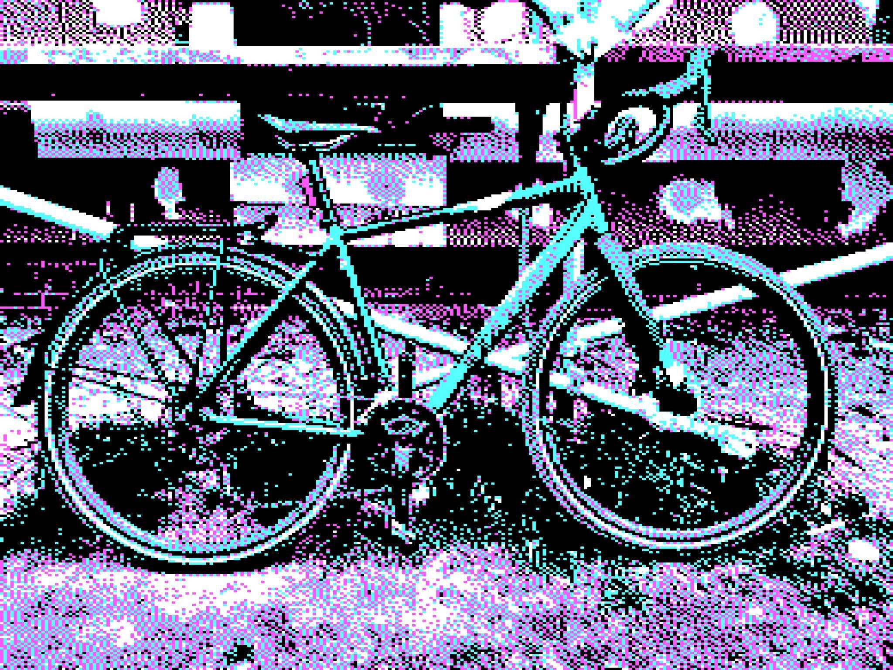

Manchmal habe ich das Gefühl ich werde zu einem Klischeeradler. Helm und Brille auf, Windjacke an und an - ausgelöst von einem kleinen Frustmoment (Vorfahrt genommen) - fahre ich wie die letzte Scheiße. Schnell, bisschen rücksichtsloser. Ziemlich pissig und mit Tunnelblick.

Zu Hause angekommen bin ich mir dann nicht sicher, ob das so sein muss oder sollte. Keine Zeitersparnis, mehr Schweiß. Nicht wirklich Spaß. Andere Leute vielleicht pissed weil man auch nur entspannt rollen wollte bis der Bikeraser vorbei kam. Und eigentlich will ich doch auch nur entspannt ein paar Meter machen. Cool auf dem Gravere hocken, der Fahrtwind, das Geräusch vom Freilauf unter mir. Bisschen so relaxed wie die Bikecouriere in den New York Videos von Terry.

