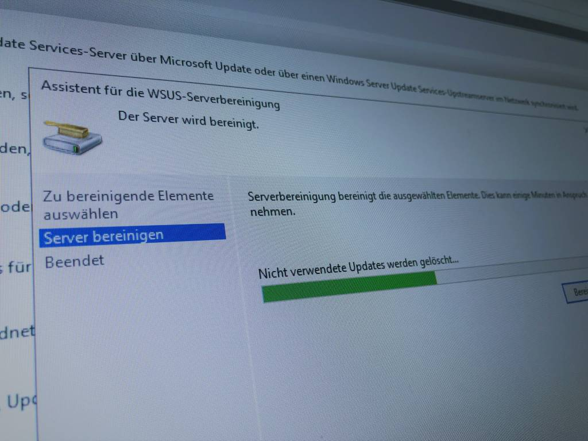

Seit irgendwann letzter Woche oder so konnte man unseren tollen WSUS Server nicht mehr richtig bedienen, weil die Datenbank so sehr ausgelastet und zugemüllt war, dass dauernd die Nachricht "Serverknoten zurücksetzen" erschienen ist. Kennt man ja.

Da guckt man mal in die "Produkte und Spezifikationen" Auswahl des Updateservers rein und findet massig Treiber und solch einen Kram. Etwas, was man nie, nie, nieeemals dem WSUS antun sollte. Es ist einfach zu viel Durcheinander für dieses zärtliche Wesen.

Nun ging ich also hin und entfernte Treiber und alles, was nur Müll macht, aus den Produkten aber konnte die Bereinigung nicht durchziehen. Immer lastete der Prozess die Datenbank so sehr aus, dass mir die MCC/der Server abgeraucht ist.

Also erinnerte ich mich an [das CleanUp Script von Bryan Dam](https://damgoodadmin.com/2017/11/05/fully-automate-software-update-maintenance-in-cm/), welches auch WSUS Server wieder zum laufen bringen sollte, die man über Jahre hinweg dreckig hat werden lassen. Ließ das Script mit -FirstRun und -UseCustomIndexes laufen und siehe da: Er säubert die WSUS-Partition von 91gb frei auf (!!!) 320gb frei. Noch fix eine Aufgabe für jeden Sonntag um 12 Uhr Mittags drauß gebastelt und tschüss.

Ich starte das Teil also neu und es schnurrt wie ein Kätzchen.

So. Wochenende.