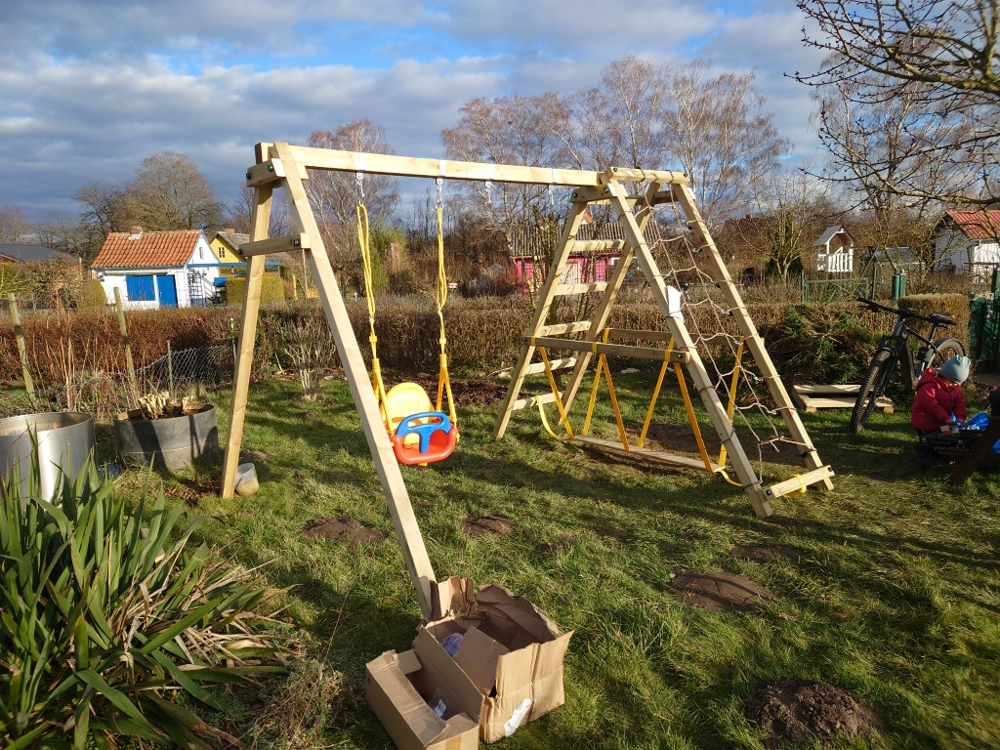

Eigentlich ist es ja ein etwas später Zug über unseren "neuen" Schrebergarten hier direkt mit dem Aufbau unserer brand neuen Kinderschaukel zu starten, aber was solls...

Kurz vorweg: Ich hätte nicht gedacht, dass es so ein Akt ist ein Schaukelgestell aufzustellen, aber lest erst mal rein hier.

Extra für Samstag Vormittag hatte ich einen guten Freund dazugeholt, um gemeinsam die Schaukel aufzubauen und früh am Morgen mahnte meine Frau noch: "Hast du alles Werkzeug?" Und ich nur so: "Jaja, ich hab alles" Alles ganz locker, dachte ich mir so. Also, hätte ich mal auf meine Frau gehört :D

Wir also im Garten am Auspacken und fangen an, die ersten Balken zusammenzuschrauben und ich merke irgendwann, dass die großen Schrauben zwischen so spezielle Plastik Unterlegscheiben mit Nässe- und Stoßschutz kommen. Konnte ich nicht mit dem Maulschlüssel festziehen. Im Garten umgeschaut, nirgendwo eine Nuß gefunden. Bisschen grantig geworden. Dann irgendwann eine 17er Nuß gefunden. War dann schon erleichtert. Kurz darauf dann festgestellt, dass die Nuß auf nix drauf passt und auch nix da ist.

Mein Kumpel meinte also: "Komm, fahr halt schnell zum Baumarkt" Ich also zum Baumarkt und einen Adapter für den Akkuschrauber besorgt. Zurück im Garten schon bisschen gefreut, dass es nun angehen kann. Und was passiert?

Der Akkuschrauber packt nicht genug Newtonmeter um die Schrauben ins Holz zu ballern.

