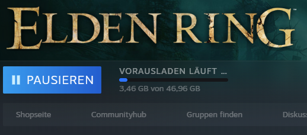

Yeeeees. Eigentlich wollte ich keine Open World Games mehr kaufen und spielen, aber nachdem ich das [Video zum Test bei Gamestar](https://www.youtube.com/watch?v=jJdzHtYTpu0) gesehen hatte...bäm, Impulskauf.

Ich mein: allein die schiere Größe und Vielfalt der Spielwelt...ich freue mich richtig drauf. Auch bin ich mit so Roguelikes inzwischen irgendwie begeistert dabei (Dead Cells, Hades) und obwohl ich nicht wirklich die Zeit für so ein Game hab muss es einfach sein. Einfach mal rein in diese brilliante Fantasywelt, die ja ein wahres Meisterwerk sein soll wie man so hört. Und in diesen Zeiten ist es gar nicht so schlecht ab und zu mal abzutauchen.
