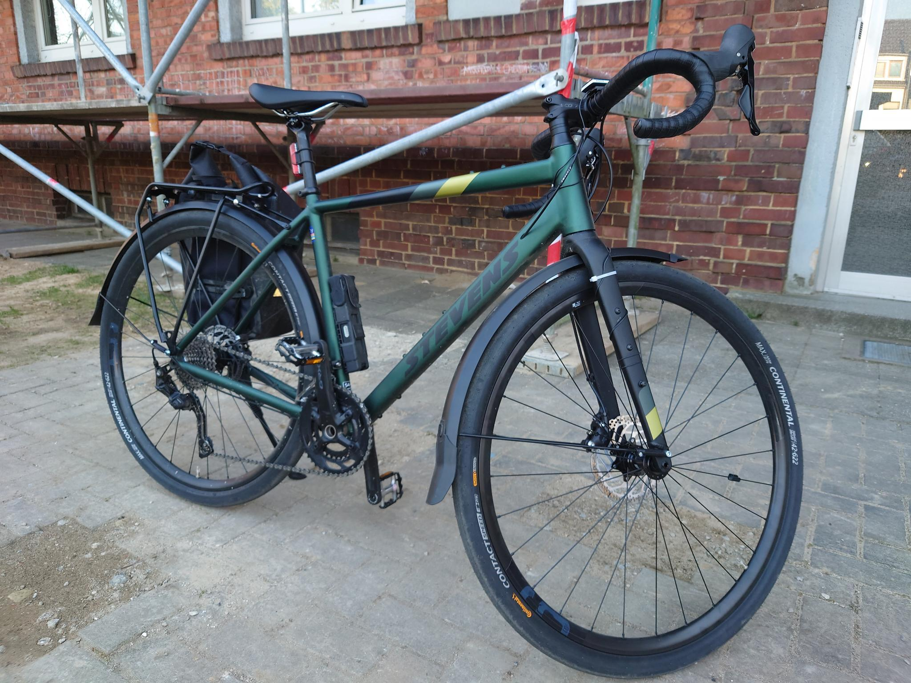

Seit etwas mehr als einem Monat bin ich nun auch stolzer Besitzer eines Gravelbikes - eines Stevens Gravere - und natürlich habe ich direkt damit angefangen ein wenig daran herumzuwerkeln.

Aber lasst mich kurz sagen, dass ich schon bei der ersten Fahrt gemerkt habe was für einen tollen Hobel ich da erstanden habe und ich wette mal, meine Fitness wird sich mit dem Ding auch noch deutlich verbessern.

Also wie man sieht wollte ich es etwas tauglicher für den Alltag machen, was mit dem Gepäckträger "Light-it" und den Primus Schutzblechen von SKS schon mal sehr gut funktioniert hat. Auch, wenn es etwas frickelig war mit der Befestigung der Schutzblechstreben. 

Ich hatte auch die mitgelieferten G-One Bite Reifen gegen Semislicks von Conti getauscht, was mir nun aber doch ein wenig misfällt und so überlege ich schon wieder die Schutzbleche zu entfernen und die Bites wieder aufzuziehen. Ich komme nicht um den Gedanken herum dem Bike mit meinem jetzigen Setup etwas von seiner Wildheit genommen zu haben. Oder ich lasse die Schutzbleche doch dran und mache nur die Bites wieder drauf? Fragen über Fragen. Ich stehe neben dem Bike und fahre mir mit den Fingern durch den Bart.

Alles in Allem bin ich dennoch sehr, sehr happy damit und schön fix unterwegs hier im urbanen Raum und ich meine das Bike wird mich so einige Zeit begleiten auf den Radwegen der Region :)