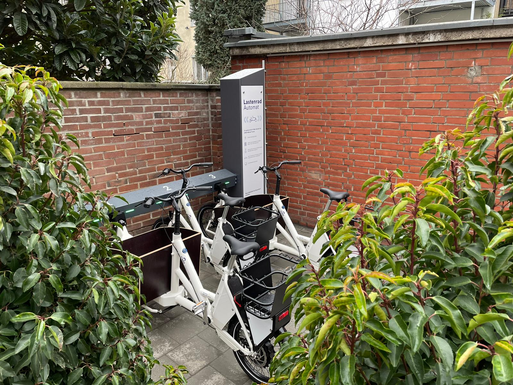

In Düsseldorf Bilk gibt es nun eine tollen Lastenradautomaten. Dort dann man sich bei Bedarf ein Lastenrad ausleihen und zwar draußen und per App:



Und das ist sowas, was ich mir für Braunschweig und die Stadtteile auch wünsche. Wir haben hier [Heinrich Lastenlöwe](https://www.heinrich-der-lastenloewe.de/) und wie cool wäre es, wenn dieses Prinzip für die Stadtteile übernommen werden wüde? Ich hatte da schon ab und zu mal mit meiner Frau drüber gesprochen und wir fänden es mega, wenn wir einfach eine Straße
weiter ein Lastenrad leihen könnten. Denn wir könnten uns zwar eins kaufen, aber können es nicht sicher abstellen und würden es auch nicht jeden Tag benötigen.
